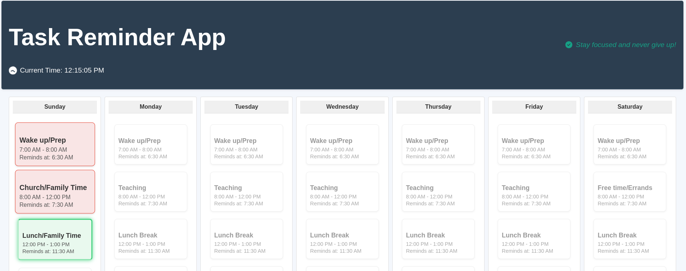

# Reminder App

This project is a simple reminder application that helps users to set and manage reminders for various tasks. The app is built using modern web technologies and provides a user-friendly interface for creating, editing, and deleting reminders.


## Setup Steps

1. **Clone the repository:**
    ```sh
    git clone https://github.com/andrew21-mch/myschedule-nodejs-express.git
    cd myschedule-nodejs-express
    ```

2. **Install dependencies:**
    ```sh
    npm install
    ```

3. **Set up environment variables:**
    Create a `.env` file in the root directory and add the necessary environment variables. Refer to `.env.example` for the required variables.

4. **Run the application:**
    ```sh
    npm start
    ```

5. **Access the application:**
    Open your browser and navigate to `http://localhost:3000` to start using the Reminder App.

## Project Structure

The project has two main folders:

- **frontend**: Contains the React application.
- **backend**: Contains the Node.js and Express server.

## Features

- Create new reminders
- Edit existing reminders
- Delete reminders
- View all reminders in a list

## Technologies Used

- React
- Node.js
- Express
- MongoDB

## Contributing

Contributions are welcome! Please fork the repository and submit a pull request.

## License

This project is licensed under the MIT License.